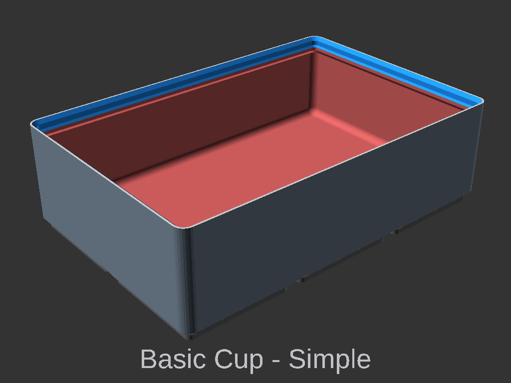
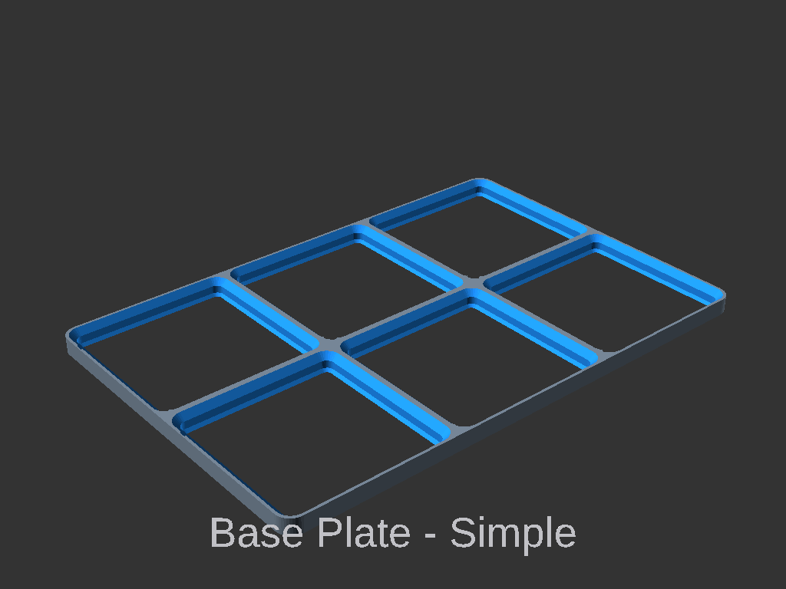
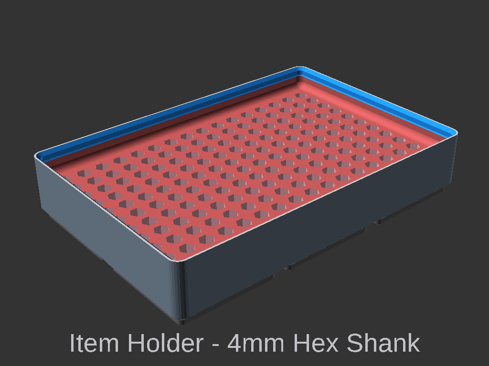
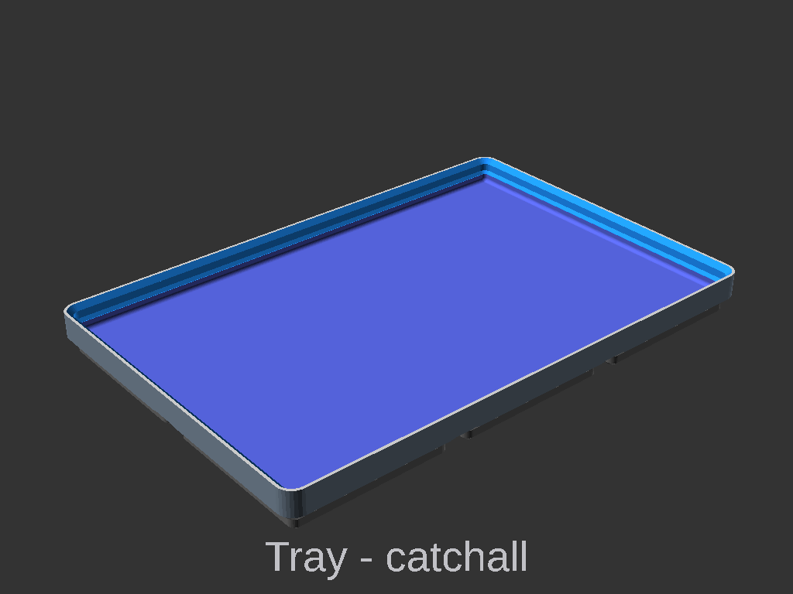

# Gridfinity Extended OpenSCAD Model

Welcome to the Gridfinity Extended OpenSCAD project! This is a recreation of Zack Freedman's Gridfinity system in OpenSCAD, designed to accurately reproduce the original Gridfinity bins while adding extra features and customization options.

## Features
- Accurate reproduction of Zack Freedman's original Gridfinity bins.
- Additional features and customization options for the base model.
- Extension patterns for further personalization and modularity.

## Getting Started
**Gridfinity Extended** is a set of OpenSCAD scripts for generating gridfinity related 3d models. There are two main ways to use the scripts. 
- There is the official online customiser hosted at [makerworld](https://makerworld.com/en/models/481168-gridfinity-extended#profileId-1037829). 
- Alternatively you can download and run the scripts locally.

### Option 1: Online customiser
You can also use the online version of this project hosted on [MakerWorld](https://makerworld.com). This option allows you to quickly experiment with the models without downloading anything. 
The scripts uploaded to are fully featured and supported. I keep these updated with the latest version from GitHub.<br>
- Link: https://makerworld.com/en/models/481168-gridfinity-extended#profileId-1037829

### Option 2: Running locally
Running locally is how I recommend running the scripts. The scripts run faster and you can save your configuration. However but it does require you download and install the OpenSCAD software on your local machine.

1. Install OpenSCAD. This project relies on features available in the **OpenSCAD Developer Version**. Make sure to download it from [OpenSCAD Developer Version](https://openscad.org/downloads.html#snapshots).

2. Clone or download this repository to your local machine:
   ```bash
   git clone https://github.com/ostat/gridfinity_extended_openscad.git
   ```
   Alternatively, you can download the ZIP file from the repository page and extract it.

3. Enable OpenSCAD Features.
   - Open OpenSCAD application
   - Go to `Menu > Edit > Preferences`. 
   - In the **Preferences** dialog go to the **Advanced** Tab:
     - Backend: select **manifold** option. Makes OpenSCAD faster.
   - An then go to the **Features** Tab:
     - Check **textmetrics**: Enables text related features for the base text.

4. Open the project files in OpenSCAD. **Note:** You must use the developer version of OpenSCAD for this project. Download it here: [OpenSCAD Developer Version](https://openscad.org/downloads.html#snapshots).

5. Start exploring and customising the Gridfinity bins and extensions!


## Official Documentation
Official detailed documentation for each of the scripts can be found here [gridfinity-extended](https://docs.ostat.com/docs/openscad/gridfinity-extended)


## Scripts Overview
### Gridfinity Basic Cup
Script: `gridfinity_basic_cup.scad`<br>
This script creates the basic **Gridfinity Cup** with customizable dimensions, magnet slots, and divider options. It serves as the foundation for most Gridfinity bins.<br>
[](./Images/gridfinity_basic_cup-demo_text.gif)

### Gridfinity Base Plate
Script: `gridfinity_baseplate.scad`<br>
This script generates customizable Gridfinity baseplates. It includes options for magnet placement, weighted bases, and various styles to suit different applications.. Supports creating of customisable shapes.<br>
[](./Images/gridfinity_baseplate-demo_text.gif)


### Gridfinity Drawers
Script: `gridfinity_drawers.scad`<br>
Creates modular drawers for Gridfinity bins. Includes options for drawer sizes, handles, and dividers, allowing for efficient organization.

### Gridfinity Extended Item Holder
Script: `gridfinity_item_holder.scad`<br>
Customisable Grid based item holder. Has built in dimensions of many common Memory card, Cartridges, batteries, and tools.<br>
[](./Images/gridfinity_item_holder-demo_text.gif)

### Gridfinity Extended Tray 
Script: `gridfinity_tray.scad`<br>
Catch all tray for holding small items.<br>
[](./Images/gridfinity_tray-demo_text.gif)

### Gridfinity Marble Run
Script: `gridfinity_marble.scad`<br>
A fun and creative script for generating marble runs that are compatible with the Gridfinity system. Great for educational or entertainment purposes.

### gridfinity_lid.scad
Creates lids for Gridfinity bins. Includes options for sliding lids, hinged lids, and magnet-secured lids to keep items secure.

### gridfinity_silverware.scad
Creates organizers for silverware that fit within the Gridfinity system. Perfect for kitchen organization.

### gridfinity_chess.scad
Generates a Gridfinity-compatible chess set. Each piece is designed to fit within the Gridfinity system, making it easy to store and organise.

### gridfinity_sliding_lid.scad
A specialized script for creating sliding lids for Gridfinity bins. Includes options for locking mechanisms and smooth sliding functionality.

### gridfinity_socket_holder.scad
Generates holders for sockets and other tools, ensuring compatibility with the Gridfinity system. Includes predefined dimensions for common socket sizes.

### gridfinity_baseplate_flsun_q5.scad
A specialized version of the baseplate script tailored for the FLsun Q5 3D printer. It ensures compatibility with the printer's build dimensions and features.

## How to Contribute

I welcome contributions to help improve and expand the Gridfinity Extended library! Here’s how you can contribute:

1. **Fork the Repository**: Create your own fork of the project to make changes.
2. **Make Improvements**: Add new features, fix bugs, or improve documentation.
3. **Submit a Pull Request**: Once your changes are ready, submit a pull request to the main repository for review.

## Feedback and Support

Your feedback is invaluable! If you have suggestions, issues, or ideas for improvement, feel free to open an issue or contribute to the project. 

---

Thank you for exploring the Gridfinity Extended OpenSCAD project! I hope you enjoy customising and expanding your Gridfinity system.

This project is based on work by Zack Freedman's of [voidstarlab](https://www.voidstarlab.com/) and [vector76](https://github.com/vector76/)'s [gridfinity_openscad](https://github.com/vector76/gridfinity_openscad)
